# JAWS-UG名古屋 CodeCatalystハンズオン
2024/09/26実施の JAWS-UG名古屋のハンズオン資料です.
CodeCatalystでの統合的な開発を体験してみます.
元ネタ: [Tutorial: Creating a full-stack application with composable PDK blueprints](https://docs.aws.amazon.com/codecatalyst/latest/userguide/pdk-blueprints-tutorial.html#pdk-tutorial-generate-infrastructure)


## 1. 前提
- AWSアカウントを所有していること
- AWS Builder IDが存在していること
- 自身のPCにVSCodeがインストールされていること

---
## 2. CodeCatalyst Space作成 (15分?)
CodeCatalystの初期設定を行う.
[CodeCatalystリンク](https://codecatalyst.aws/explore)
1. 上記リンクを開きし, Sign upをクリック.
2. Builder IDを持っていない場合はここで作成. 既にあればそれを利用してログインする.
3. スペース作成. 「jaws-nagoya-xxxx」(xxxxは任意の文字列)という名前で作成. (スペース名はリージョンでユニークでなければならない)
   リージョンは「US West(オレゴン)」を選択.
   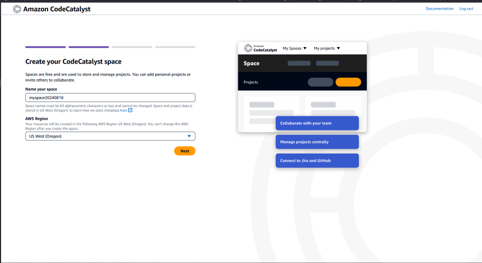
4. AWSアカウントとの紐づけ. アカウントIDを入力すると, トークンが表示される. 
　 このトークンをコピーし, 「Go to the AWS console to verify」からAWSアカウントにログインする. 
 　トークンをAWS側の画面に貼り付けて「Verify」をクリック.
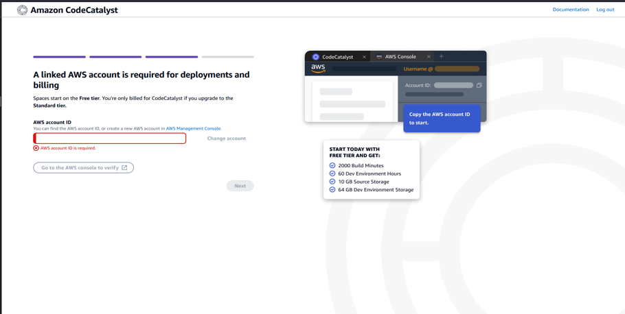
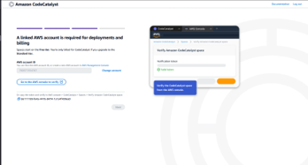
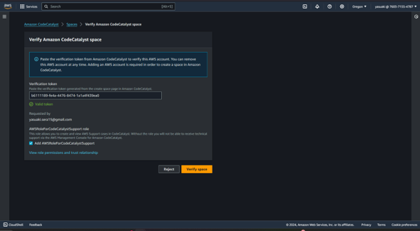
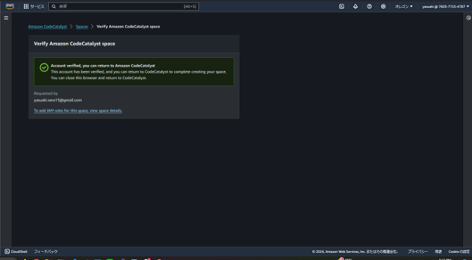
5. しばらく待つ.
6. プロジェクト作成画面へ移動する
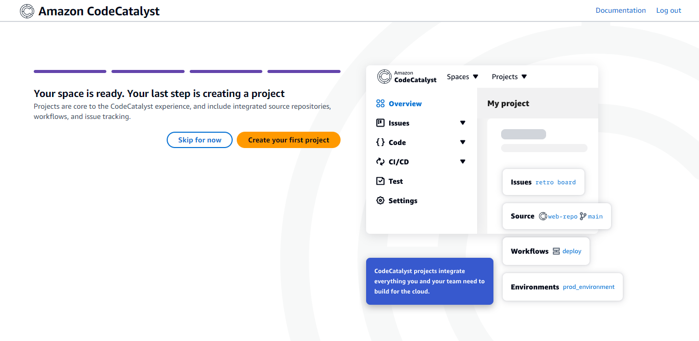

---
## 3. プロジェクト作成(3分)
1. プロジェクト作成画面にて「Start with a blueprint」 -> 「CodeCatalyst blueprintsタブ」->「PDK - Monorepo」を選択して「Next」をクリック.
2. 以下の項目を入力
- Name your project: jawsnagoya
- Primary programming language: Typescript
3. 右下の「Create project」をクリック.


---
## 4. 眺めてみる
CodeCatalystでできることを眺めてみる. プロジェクトのメニュー画面の概要.
- issue: コードに対してissueを発行できる. (CodeCommitには無かった??)
- Code: リポジトリ内のコードの閲覧/履歴管理や, プルリクエスト管理, 開発環境構築/管理ができる.
- CI/CD: ワークフロー管理, デプロイ先の環境管理, シークレット管理などができる.
- Reports: CICDのレポート確認ができる.
- Packages: アーティファクト等の管理?
- Blueprints: CodeCatalystでプロジェクトを作成する際に使用するテンプレートを管理する.
- Project setting: プロジェクトの設定

---
## 5. 型安全なAPIをプロジェクトに追加
PDKのブループリントを使用して, 型安全なAPIを追加する.

1. 画面左側のBlueprintsをクリックし, Blueprintの一覧を表示する.
2. 画面右上のAdd blueprintをクリックする.
3. 「PDK - Type Safe API」を選択し, Nextをクリック.
4. 設定値を確認する. 

- Target version: 0.0.131 (デフォルト値)
- Model Language: Smithy (デフォルト値)
- Namespace: com.aws (デフォルト値)
- API name: JawsNagoyaApi
- CDK language: Typescript (デフォルト値)
- Handler langages: Typescript (デフォルト値)
- Documentation formats: HTML_REDOC (デフォルト値)
5. 「Add blueprint」をクリック.
6. リポジトリにblueprintを追加するプルリクエストが作成されるので, これをマージする.  
画面左側の「Code」から, 「Pull requests」をクリック.
7. 「chore(resynthesis): update [pdk-type-safe-api@0.0.131]」をクリック. 
8. 画面右上の「Merge」をクリック.
9. 「Fast forward merge」を選択し, 右下のMergeをクリック.
10. 画面左側「Blueprints」からブループリントの一覧を確認し, Statusが Up to dateになっていることを確かめる.
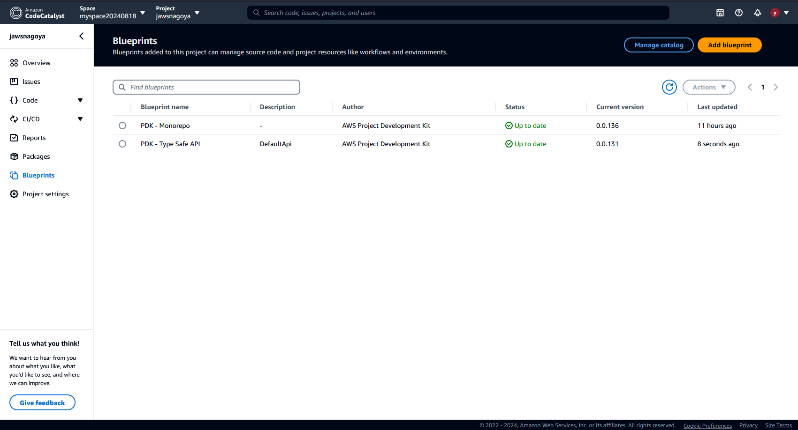

---
## 6. Reactベースのwebサイトをプロジェクトに追加
PDKのブループリントを使用して, Reactベースのwebサイトを追加する.
先ほど適用した型安全APIのブループリントと関連付けたwebサイトを作ることができる.

1. 画面左の「Blueprints」をクリックし, 画面右上「Add blueprint」をクリック
2. ブループリントの一覧から, 「PDK - Cloudscape React Website」を選択して「Next」をクリック.
3. 設定値を編集する
- Target version: 0.0.138
- Website Name: 「JawsNagoyaSite」
- Type Safe Apis(Webサイトに統合するAPIブループリントを選択): 「PDK - Type safe API」⇒ 認証されたクライアントが設定され, 依存関係やAPIエクスプローラーやその他の機能が追加
4. 「Add blueprint」をクリック.
5. 先ほどと同様に, リポジトリにプルリクエストとして追加されたブループリントをマージする.
「Code」->「Pull requests」 -> 「chore(resynthesis): update [pdk-cloudscape-react-website@0.0.138]」->「Mearge」 -> 「Fast forward mergeを選択してマージ」

---
## 7. インフラを追加
PDKのブループリントを使用して, CDKからAWSリソースをデプロイするためのコードをプロジェクトに追加する.
webサイトとAPIをデプロイするために構成されたCDKコードをプロジェクトに付与する. 
CDKで作成するCloudFormationのスタック名を覚えておくこと.

1. 画面左の「Blueprints」をクリックし, 画面右上「Add blueprint」をクリック
2. ブループリントの一覧から, 「PDK - Infrastructure」を選択して「Next」をクリック.
3. 設定値を編集する
- Target version: 0.0.132(デフォルト値)
- CDK language: Typescript
- stack Name: 「jaws-nagoya-handson」
- Type Safe APIs(CDKで構築するAPIのブループリントを選択): 「PDK - Type safe API」
- Type Safe APIs(CDKで構築するwebサイトのブループリントを選択): 「PDK - Cloudscape React Website」
4. 「Add blueprint」をクリック.
5. 先ほどと同様に, リポジトリにプルリクエストとして追加されたブループリントをマージする.
「Code」->「Pull requests」 -> 「hore(resynthesis): update [pdk-infra@0.0.132]」->「Mearge」 -> 「Fast forward mergeを選択してマージ」

---
## 8. 開発環境の立ち上げ
この後DevOpsパイプライン用のブループリントを適用するのだが, このままだとパッケージの依存関係の問題でCDKのデプロイがうまくいかない. 
このためコード修正を先に行うが, せっかくなのでCodeCatalystの開発環境で修正を行う.
開発環境はVSCodeで開いてみる(裏ではインスタンスを立てて, 自動的にsshでリモート接続している.)

1. 画面左側「Code」 -> 「Dev Environments」をクリック.
2. 「Create Dev Environment」をクリックし,  「Visual Stdio Code」を選択. 
3. 以下の設定値で「Create」をクリック
- Repository: 「Clone a repository」
- Repository: monorepo(デフォルト)
- Branch: 「Work in new branch」
- Branch name: develop
- Create branch from: main
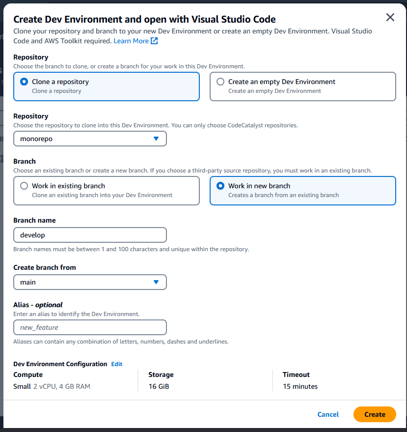
4. ブラウザから, URLをVSCodeで開くか聞かれるのでその通りに従う.
5. しばらくすると, CodeCatalystにssh接続したVSCodeの新しいウィンドウが開く.(この間, 必要な拡張機能等あれば都度インストールする)

---
## 9. コード修正
VSCode上からコード修正し, リモートに開発用ブランチをpushする.

1. VSCode上でターミナルを開く. (タブ -> ターミナル -> 新しいターミナル)
2. ブランチの確認(エラーは無視してよい. 画面表示を制御するページャとして設定されているlessコマンドが存在していないだけで, 本質的には特に関係ない.)
```
# developブランチにいることを確認.
bash-5.2# git branch
error: cannot run less: No such file or directory
* develop
```
3. gitの登録情報を確認(ユーザ名とパスワードが登録されているか確認)
```
bash-5.2# git config --list
(略)
user.name=xxxxxx
user.email=xxxxxxxxxxxxxx
(略)
```
CodeCatalystで作成した開発環境はユーザの登録が済んでいる.

4. コードの編集. 「.projen/deps.json」を開く. projenのversion指定の記載を以下に書き換える.
before
```
    {
      "name": "projen",
      "version": "^0.79.24",
      "type": "build"
    },
```

after
```
    {
      "name": "projen",
      "version": "^0.82.8",
      "type": "build"
    },
```

5. コミット作成& プッシュ.
以下のコマンドを実施する.
```
git add -A
git commit -m "update .projen/deps.json"
git push origin develop
```

---
## 10. プルリクエスト作成 & マージ
1. 画面左側「Code」 -> 「Pull requests」をクリックし, Create pullrequestを作成する. 

2. プルリクエストの詳細を入力する.
- Source repository: monorepo
- Destination branch: main
- Source branch: develop
- Pull request title: 「update .projen/deps.json」
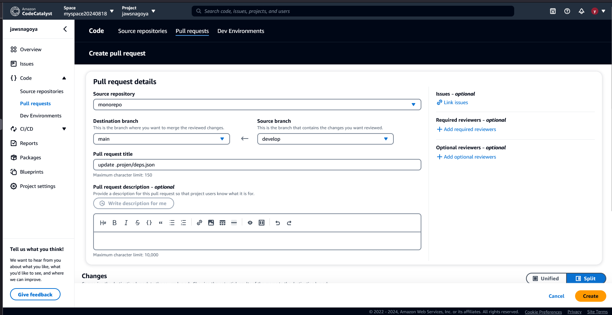
3. プルリクエストが作成される. ここで, 画面右上の「Merge」をクリックする.
4. 「Fast forward merge」を選択し, 「Merge」をクリック.
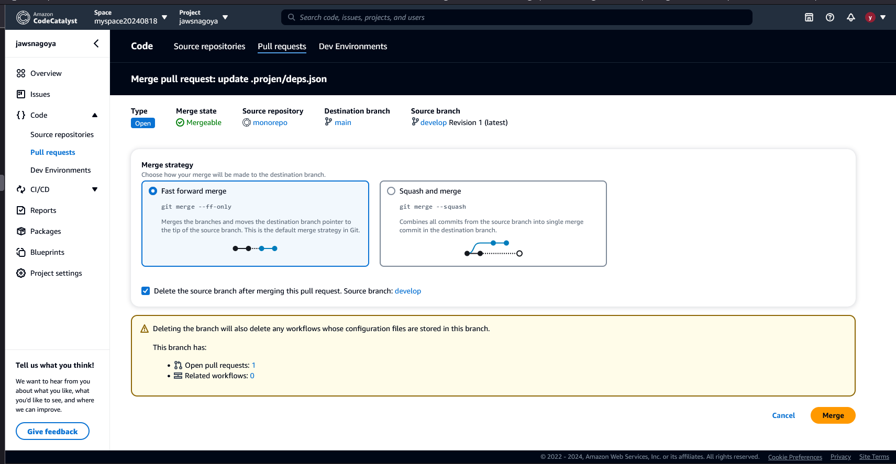


---
## 11. DevOpsを追加
PDKのブループリントを使用して, AWSアカウントにプロジェクトをビルド&デプロイするワークフローを作成する.

1. 画面左の「Blueprints」をクリックし, 画面右上「Add blueprint」をクリック
2. ブループリントの一覧から, 「PDK - DevOps」を選択して「Next」をクリック.
3. 設定値を編集する
- Target version: 0.0.158(デフォルト値)
- Bootstrap CDK: 有効(チェックボックス入力)(デフォルト値)
- stack Name: 「jaws-nagoya-handson」(前項で入力したstack名と一致させる)
- AWS account connection: 「(自身のAWSアカウント番号を選択)」
- IAM Role: 「CodeCatalystWorkflowDevelopmentRole-<スペース名>」(CodeCatalystに関連付けたIAMロールがない場合 -> Add IAMロールからIAMロールの追加を行う)
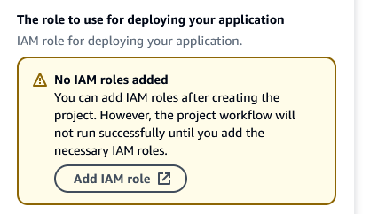
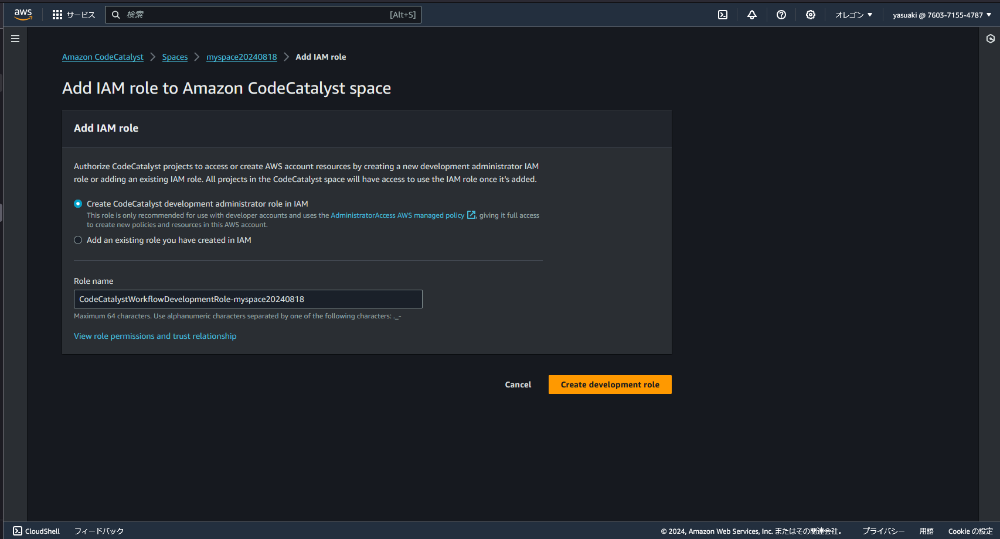
- Region: 「Asia Pacific(Tokyo)」
4. 「Add blueprint」をクリック.
5. 先ほどと同様に, リポジトリにプルリクエストとして追加されたブループリントをマージする.
「Code」->「Pull requests」 -> 「chore(resynthesis): update [pdk-devops@0.0.158]」->「Mearge」 -> 「Fast forward merge」を選択してマージ

---
## 12. ワークフローの稼働確認
DevOpsのブループリントにて作成したワークフローが正常に稼働し、アプリケーションが環境にデプロイされることを確認する.

1. 画面左側の「CI/CD」-> 「Workflowsをクリック」
2. 「release」の方をクリックすると, マージ作成からデプロイまでの一連のワークフローが確認できる.
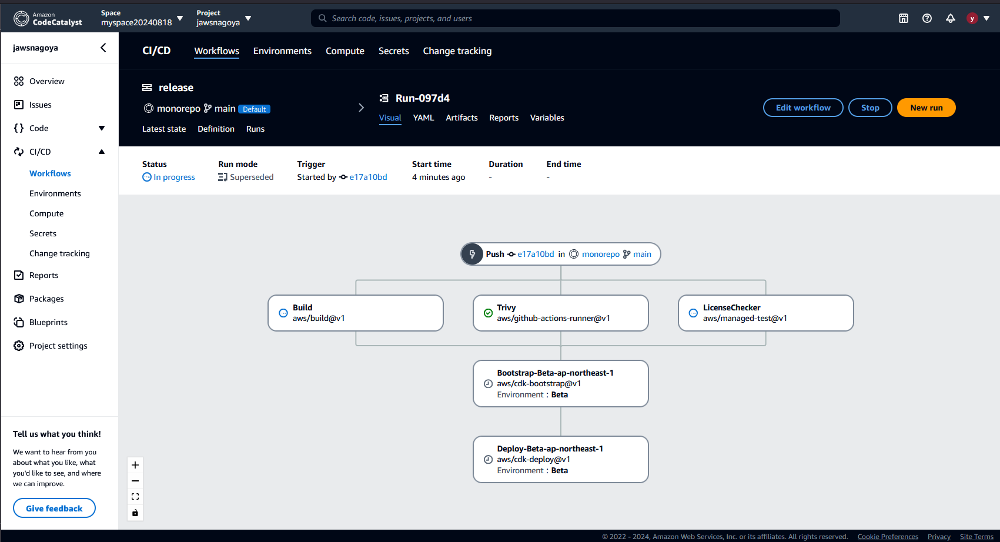

3. Buildの四角をクリックすると, 現在走っている処理の内容が確認できる. 15~20分ほど待つ.

---
## 13. webサイトログイン用ユーザ作成(オプション)
今回デプロイしたwebサイトはCognitoでユーザ管理を行っている. 
そのため, ログインのためにユーザを手動で作成する.

1. AWS Cognitoの画面を開く([リンク](https://console.aws.amazon.com/cognito/home))
2. ユーザプール一覧から, 今回作成したプールを選択する.(jawsnagoyahandsonUserIdentityUserPoolXXXXXXXXXX)
3. ユーザの作成をクリック
4. 以下の設定を行う
- 招待メッセージ: Eメールで招待を送信
- ユーザ名: handson-user
- Eメールアドレス: <受信可能なメールアドレス>
- 仮パスワード: 「パスワードの生成」
5. ユーザの作成をクリック
6. ユーザ一覧にて, ユーザが作成できていることを確認する. また, 登録したメールアドレスに仮パスワードが届いていることを確かめる.

---
## 14. デモサイトにログイン(オプション)
今回デプロイした画面を確認してみる. 

1. リリース用のワークフロー画面を開く. (画面左「CI/CD」-> 「workflows」 -> 「release」)
2. ワークフローのデプロイフェーズ(Deploy-Beta-ap-northeast-1)をクリック. 
3. Variablesタブをクリックし, 「JawsnagoyasiteDistributionDomainNameXXXXXX」の項目からCloudFrontのドメインをコピーする.
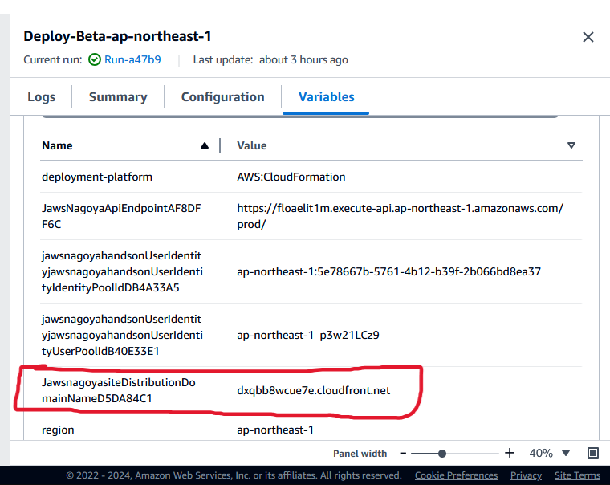
4. 3.で取得したドメインにブラウザでアクセスする.
5. ユーザ名/仮パスワードを入力する
6. 新規パスワード登録画面になるので新規パスワードを登録して次へ.
7. MFAの設定を強要されるので, スマホアプリ等を使用しMFAデバイスを登録する. (Microsoft AuthenticatorやDuo Mobileなど)
8. 以下のような, APIのエクスプローラが表示される.
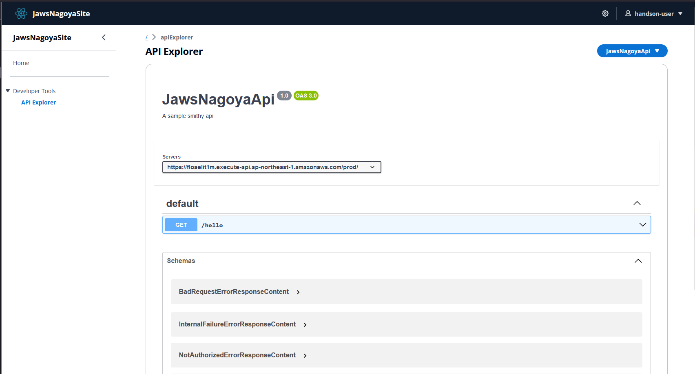

本当はここからさらにアプリの改修などをやってみたいところだが, 時間がなさそうなのでここまで. 
後片付けに入る.

---
## 15. 後片付け1 CloudFormationのスタック削除
1. AWSにログインし, CloudFormationの画面へ移動する.
2. 「jaws-nagoya-handson」のスタックを選択し, 削除をクリックする.
※ S3の削除に失敗する場合は, 中身を削除してから再度実行する.

---
## 16. 後片付け2 プロジェクトの削除
1. CodeCatalystの画面で, 画面左側「Project settings」をクリック.
2. 画面中央下部の「Delete project」をクリック.
3. 「delete」と入力してプロジェクトを削除する.(リポジトリと開発環境, その他ワークフローの成果物などが削除される)
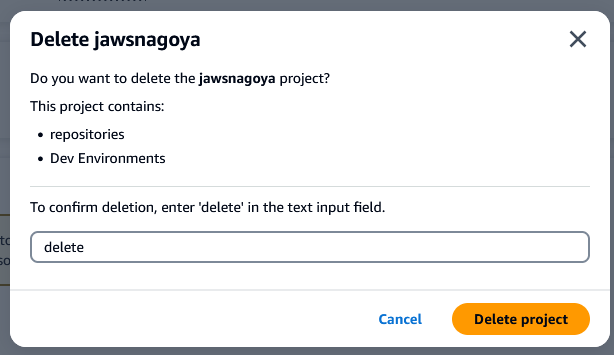

---
## 17. 後片付け3 AWSアカウントとCodeCatalystのスペース関連付け削除
1. AWSのwebコンソールから, CodeCatalystの画面へ移動する. (オレゴンリージョンを選択)
2. Space一覧でスペースにチェックを入れ, 画面右上の「Remove space」をクリック. (追加したIAMロールもここで削除される)
3. 確認画面で, スペース名を入力し削除を実行.

--- 
## 18. 後片付け4 CodeCatalystのスペースの削除
最後に, CodeCatalystのスペースを削除する.
1. CodeCatalystの画面上部のSettingsというタブをクリックする
2. 「General」-> 画面中央下部「Delete Space」の「Delete」をクリック.
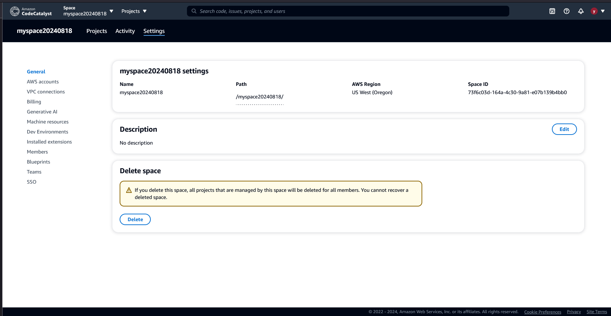
3. 確認画面に「delete」と入力して削除を実施.
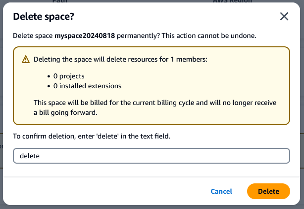

---
以上で, CodeCatalystのハンズオンは終了です.
お疲れ様でした.

今回のハンズオンを振り返ると, ポイントは以下の3つです.
1. CodeCatalystは, Gitリポジトリやissue, ワークフローなどを作成/管理することができる統合的なサービスである. 
2. Cloud9ライクな開発環境を, VSCode経由で利用できる.
3. PDK(Project Developer Kit)やBlueprintを用いて, 簡単にワークフローや環境を構築できる.

今回行ったのは, あくまでもチュートリアルの一部です.
ぜひもっと深く触ってみてください.